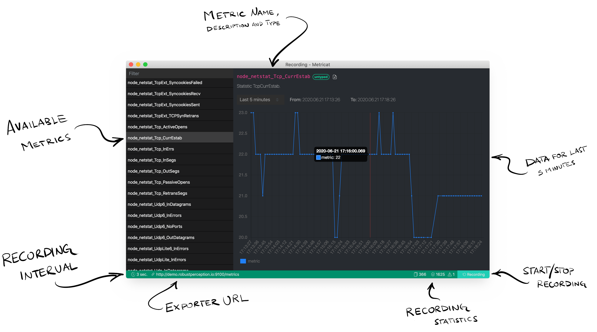

Metricat is a metrics viewer for Prometheus exporters. Think of it as a portable Grafana on your desktop.

Homepage of the project: [https://metricat.dev](https://metricat.dev/)



# Supported platforms

In principal, all platforms supported by the [electron.build](https://www.electron.build) are supported.

Maintainers of this repository currently build artifact for the following platforms:

- MacOS x64
- Windows x64
- Linux: .deb and .rpm

# Build

Currently using Electron v6.x.x, therefore need to use NodeJS v12.x.x to build.

Use thw following commands to build for various environments:

```
npm run electron:build:mac
npm run electron:build:win
npm run electron:build:deb
npm run electron:build:rpm
```

# Contributions

Contributions are welcome in the form of pull requests or issues, but the author does not provide any guarantees on the minimal time of response.
